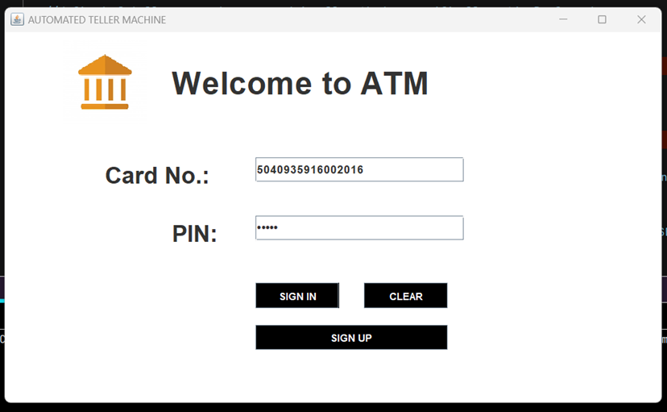
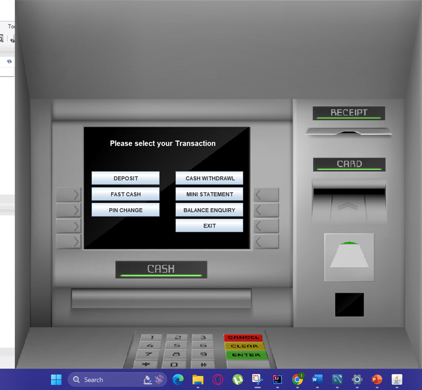
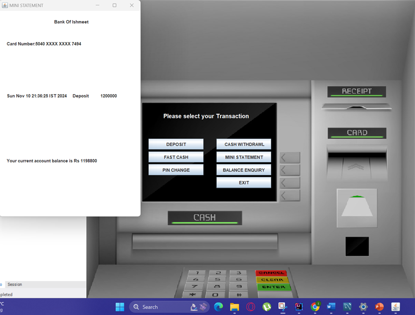

# ATM Simulator Application

## 📖 Overview
The ATM Simulator is a Java-based desktop application designed to replicate essential ATM functions within a simulated environment, offering users a realistic interface for core banking operations. This project serves as a valuable educational tool for understanding banking processes, secure data handling, and desktop application development.

---

## 🚀 Features

### 🔐 Authentication
- Sign-in / Sign-up system for secure user registration and login

### 💳 Transaction Modules
- Deposit Money  
- Withdraw Money  
- Fast Cash functionality  

### 👤 Account Management
- Balance Inquiry  
- PIN Change  
- Mini Statement (recent transactions)

### 🗄 Database Integration
- MySQL database for:
  - User credentials  
  - Account balances  
  - Transaction history  

### ⚠️ Error Handling
- Handles:
  - Invalid inputs  
  - Insufficient balance  
  - Transaction limits  

---

## 🛠 Technologies Used

- **Programming Language:** Java (AWT & Swing for GUI)
- **Database:** MySQL
- **IDE:** IntelliJ IDEA Community Edition
- **Database Tool:** MySQL Workbench
- **Diagramming Tool:** Draw.io

---

## 📊 Database Schema (ER Diagram)

The system uses five main tables:

- **signup** → Stores personal details (name, address, contact info)  
- **signup2** → Stores additional demographic details (religion, PAN, Aadhaar)  
- **signup3** → Stores account details (card number, PIN)  
- **bank** → Stores transaction records (date, type, amount)  
- **loginpg3** → Manages login credentials and authentication  

---

## 📸 Screenshots

### 🔑 Login Window

### 💼 Transaction Menu

### 📄 Mini Statement

---
